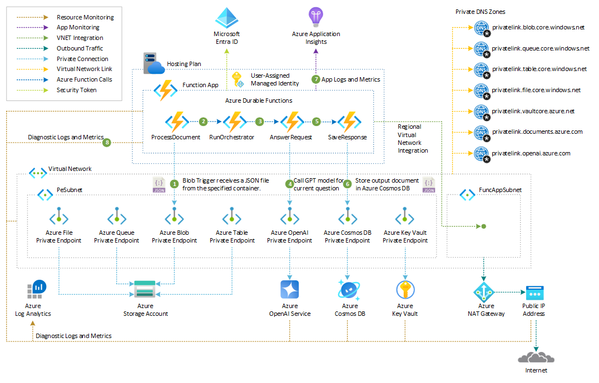
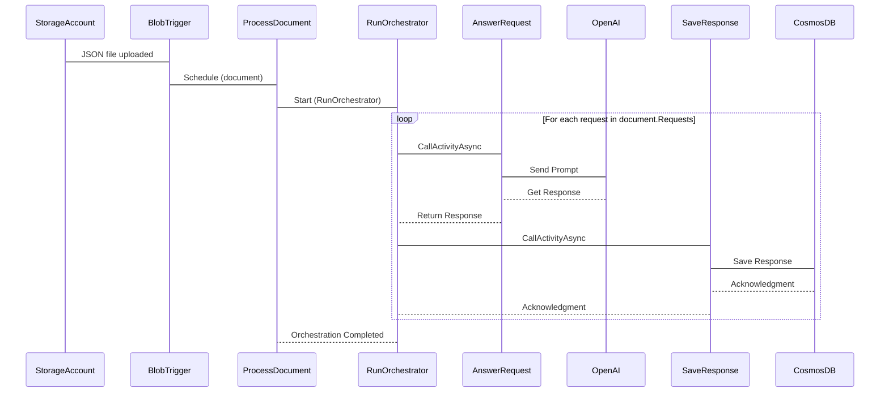
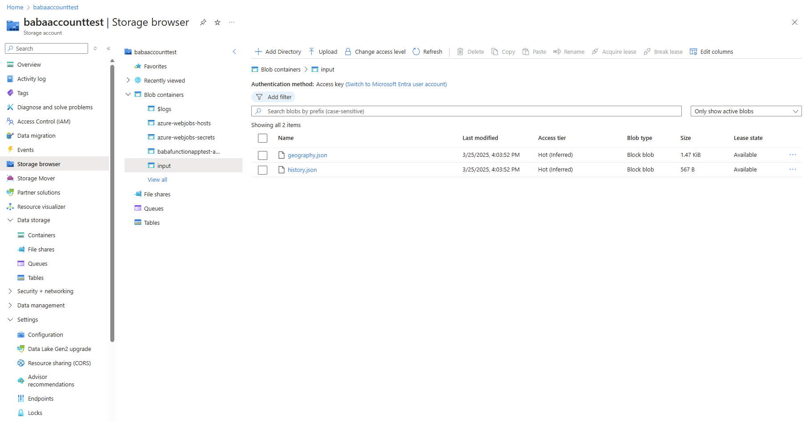
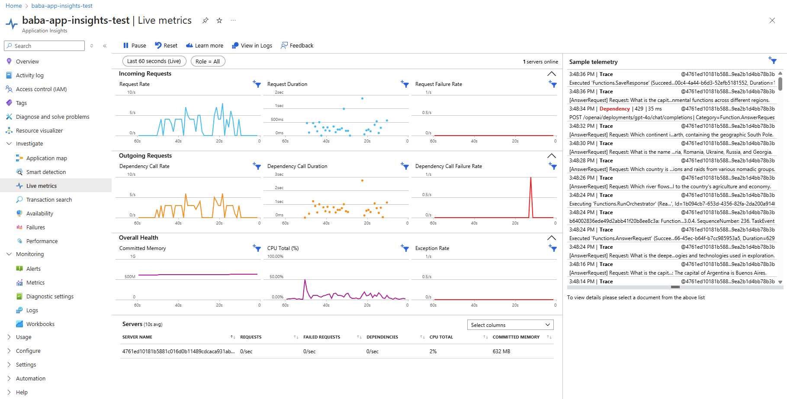
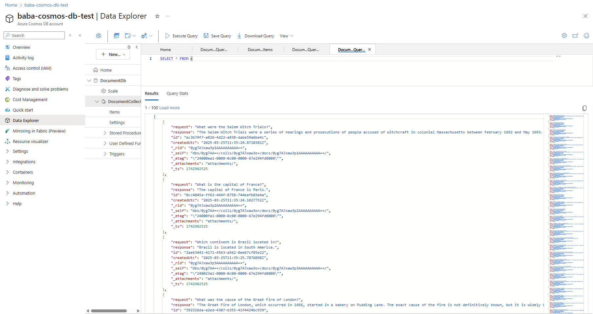
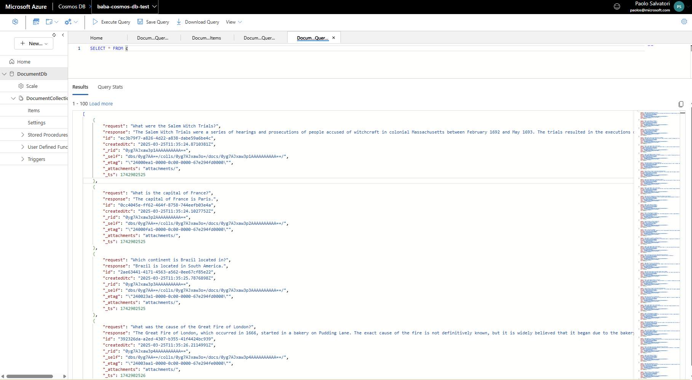

# Build an AI-Powered Workflow with Durable Functions

This sample demonstrates how to build a data pipeline using [Azure Durable Functions](https://learn.microsoft.com/azure/azure-functions/durable/durable-functions-overview). The pipeline performs the following tasks:

1. Reads questions from a JSON file dropped as a blob in an [Azure Storage Account](https://learn.microsoft.com/azure/storage/common/storage-account-overview).
2. Sends the questions to an [Azure OpenAI Service](https://learn.microsoft.com/azure/ai-services/openai/overview) chat model for processing.
3. Stores the processed results as individual documents in an [Azure Cosmos DB](https://learn.microsoft.com/azure/cosmos-db/introduction) database. 

This repository includes:

- A collection of [Bicep](https://learn.microsoft.com/azure/azure-resource-manager/bicep/overview) templates to deploy the required Azure infrastructure.
- The Azure Functions application code written in C#.

You can use the following button to deploy the Azure resources via the Azure portal:

[](https://portal.azure.com/#create/Microsoft.Template/uri/https%3A%2F%2Fraw.githubusercontent.com%2Fpaolosalvatori%2Fdurable-functions-blob-openai-cosmosdb%2Frefs%2Fheads%2Fmain%2Fbicep%2Fazuredeploy.json)

## Prerequisites

- [Visual Studio Code](https://code.visualstudio.com/) installed on one of the [supported platforms](https://code.visualstudio.com/docs/supporting/requirements#_platforms).
- [Azure Functions extension](https://marketplace.visualstudio.com/items?itemName=ms-azuretools.vscode-azurefunctions). You can also install the [Azure Tools extension pack](https://marketplace.visualstudio.com/items?itemName=ms-vscode.vscode-node-azure-pack), which is recommended for working with Azure resources.
- An active [Azure subscription](https://learn.microsoft.comazure/guides/developer/azure-developer-guide#understanding-accounts-subscriptions-and-billing). If you don't yet have an account, you can create one from the extension in Visual Studio Code.

You also need these prerequisites to [run and debug your functions locally](https://learn.microsoft.comazure/azure-functions/functions-develop-vs-code?tabs=node-v4%2Cpython-v2%2Cisolated-process%2Cquick-create&pivots=programming-language-csharp#run-functions-locally). They aren't required to just create or publish projects to Azure Functions.

- The [Azure Functions Core Tools](https://learn.microsoft.comazure/azure-functions/functions-run-local), which enables an integrated local debugging experience. When you have the Azure Functions extension installed, the easiest way to install or update Core Tools is by running the `Azure Functions: Install or Update Azure Functions Core Tools` command from the command palette.

- The [C# extension](https://marketplace.visualstudio.com/items?itemName=ms-dotnettools.csharp) for Visual Studio Code.
- [.NET (CLI)](https://learn.microsoft.comdotnet/core/tools/), which is included in the .NET SDK.

## Azure Resources

The Bicep modules provision the hosting environment for the Azure Function App, as illustrated in the architecture diagram below.



The table below outlines the Azure resources deployed by the Bicep modules and their roles in the demo.

| **Resource**                     | **Type**                                                                                                                                                                    | **Description**                                                                                                                                                                                                 |
|----------------------------------|---------------------------------------------------------------------------------------------------------------------------------------------------------------------------|-----------------------------------------------------------------------------------------------------------------------------------------------------------------------------------------------------------------|
| **Azure App Service Plan**       | [Microsoft.Web/serverfarms](https://learn.microsoft.com/azure/templates/microsoft.web/serverfarms)                                                                         | An [Azure Functions Elastic Premium](https://learn.microsoft.com/azure/azure-functions/functions-premium-plan) plan that hosts the Azure Function App.                                                         |
| **Azure Function App**           | [Microsoft.Web/sites](https://learn.microsoft.com/azure/templates/microsoft.web/sites)                                                                                     | The [Azure Function App](https://learn.microsoft.com/azure/azure-functions/functions-overview) that implements the data pipeline workflow.                                                                     |
| **Azure User-Assigned Managed Identity** | [Microsoft.ManagedIdentity/userAssignedIdentities](https://learn.microsoft.com/azure/templates/microsoft.managedidentity/userassignedidentities)                         | A [User-Assigned Managed Identity](https://learn.microsoft.com/entra/identity/managed-identities-azure-resources/how-manage-user-assigned-managed-identities) with appropriate role assignments, enabling the Azure Function App to securely access Azure Storage, Azure Cosmos DB, and Azure OpenAI Service. |
| **Azure Application Insights**   | [Microsoft.Insights/components](https://learn.microsoft.com/azure/templates/microsoft.insights/components)                                                                 | An [Azure Application Insights](https://learn.microsoft.com/azure/azure-monitor/app/app-insights-overview) instance used for monitoring and storing logs and metrics generated by the Azure Function App.       |
| **Azure Monitor Log Analytics**  | [Microsoft.OperationalInsights/workspaces](https://learn.microsoft.com/azure/templates/microsoft.operationalinsights/workspaces)                                           | A [Log Analytics](https://learn.microsoft.com/azure/azure-monitor/logs/log-analytics-overview) workspace that collects diagnostics logs and metrics from Azure resources.                                       |
| **Azure OpenAI Service**         | [Microsoft.CognitiveServices/accounts](https://learn.microsoft.com/azure/templates/microsoft.cognitiveservices/accounts)                                                   | An [Azure OpenAI Service](https://learn.microsoft.com/azure/ai-services/openai/overview) account hosting the GPT chat model used to process requests from the input JSON document.                              |
| **GPT Model Deployment**         | [Microsoft.CognitiveServices/accounts/deployments](https://learn.microsoft.com/azure/templates/microsoft.cognitiveservices/accounts/deployments)                           | A [GPT model](https://learn.microsoft.com/azure/ai-services/openai/concepts/models) deployment that generates responses based on input prompts.                                                                |
| **Azure Cosmos DB Account**      | [Microsoft.DocumentDB/databaseAccounts](https://learn.microsoft.com/azure/templates/microsoft.documentdb/databaseaccounts)                                                 | An [Azure Cosmos DB](https://learn.microsoft.com/azure/cosmos-db/introduction) account that stores the processing results.                                                                                      |
| **Azure Cosmos DB for NoSQL Database** | [Microsoft.DocumentDB/databaseAccounts/sqlDatabases](https://learn.microsoft.com/azure/templates/microsoft.documentdb/databaseaccounts/sqldatabases)                     | A [NoSQL database](https://learn.microsoft.com/azure/cosmos-db/nosql/) within Azure Cosmos DB that hosts the processing results.                                                                               |
| **Azure Key Vault**              | [Microsoft.KeyVault/vaults](https://learn.microsoft.com/azure/templates/microsoft.keyvault/vaults)                                                                         | An [Azure Key Vault](https://learn.microsoft.com/azure/key-vault/general/basic-concepts) resource for securely storing secrets. This resource is optional and not utilized in this demo.                        |
| **Azure Storage Account**        | [Microsoft.Storage/storageAccounts](https://learn.microsoft.com/azure/templates/microsoft.storage/storageaccounts)                                                         | An [Azure Storage Account](https://learn.microsoft.com/azure/storage/common/storage-account-overview) instance used by the Azure Functions runtime and for storing input documents containing requests.         |
| **Azure Virtual Network**        | [Microsoft.Network/virtualNetworks](https://learn.microsoft.com/azure/templates/microsoft.network/virtualnetworks)                                                         | An [Azure Virtual Network](https://learn.microsoft.com/azure/virtual-network/virtual-networks-overview) hosting two subnets: one for [regional virtual network integration](https://learn.microsoft.com/azure/azure-functions/functions-networking-options?tabs=azure-portal#outbound-networking-features) with the Azure Function App, and another for hosting Azure Private Endpoints. |
| **Azure NAT Gateway**            | [Microsoft.Network/natGateways](https://learn.microsoft.com/azure/virtual-network/nat-gateway/nat-overview)                                                                | An [Azure NAT Gateway](https://learn.microsoft.com/azure/nat-gateway/nat-overview) that provides outbound connectivity for the Azure Functions. This resource is not currently utilized in this demo.            |
| **Azure Private Endpoints**      | [Microsoft.Network/privateEndpoints](https://docs.microsoft.com/azure/templates/microsoft.network/privateendpoints)                                                        | [Azure Private Endpoints](https://learn.microsoft.com/azure/private-link/private-endpoint-overview) defined in the virtual network for secure access to Azure resources such as Azure Key Vault, Azure OpenAI Service, Azure Cosmos DB, and Azure Storage services (Blob, Queue, Table, and File). |
| **Azure Private DNS Zones**      | [Microsoft.Network/privateDnsZones](https://docs.microsoft.com/azure/templates/microsoft.network/privatednszones)                                                          | [Azure Private DNS Zones](https://learn.microsoft.com/azure/dns/private-dns-privatednszone) used for DNS resolution of Azure Private Endpoints.                                                                |

> [!NOTE]
> For completeness, the default deployment includes an [Azure Key Vault](https://learn.microsoft.com/azure/key-vault/general/basic-concepts) resource, although it is not utilized in this demo. To exclude Azure Key Vault from the deployment, set the `deployKeyVault` parameter to `false`.

## Azure Function App

The Azure Function App orchestrates a durable workflow designed to process questions extracted from a JSON file uploaded to a designated container in [Azure Blob Storage](https://learn.microsoft.com/azure/storage/common/storage-account-overview). When a new or updated JSON file is detected, the [Azure Blob Storage Trigger](https://learn.microsoft.com/azure/azure-functions/functions-bindings-storage-blob-trigger) initiates a new function instance. This function validates and deserializes the input document before starting a new instance of the [RunOrchestrator function](https://learn.microsoft.com/azure/azure-functions/durable/durable-functions-orchestrations). The orchestrator function then iterates through each question contained in the input document, processing them one by one.

During the orchestration, the function invokes an [Activity function](https://learn.microsoft.com/azure/azure-functions/durable/durable-functions-types-features-overview#activity-functions) that leverages the [Azure OpenAI extension](https://learn.microsoft.com/azure/azure-functions/functions-bindings-openai). This extension enables the Azure Function App to send each question to the `/chat/completions` endpoint of a [GPT model](https://learn.microsoft.com/azure/ai-services/openai/concepts/models) hosted by a specified [Azure OpenAI Service](https://learn.microsoft.com/azure/ai-services/openai/overview). 

If the GPT model successfully generates a response, the orchestrator invokes another [Activity function](https://learn.microsoft.com/azure/azure-functions/durable/durable-functions-types-features-overview#activity-functions) that uses the [Azure Cosmos DB output binding](https://learn.microsoft.com/azure/azure-functions/functions-bindings-cosmosdb-v2-output) to store an output document containing the question and its corresponding response in [Azure Cosmos DB](https://learn.microsoft.com/azure/cosmos-db/introduction). [Azure Cosmos DB for NoSQL]((https://learn.microsoft.com/azure/cosmos-db/nosql/)) is a native non-relational service for working with the document data model. It can arbitrarily store native JSON documents with flexible schema. Data is indexed automatically and is available for query using a flavor of the SQL query language designed for JSON data.  

This application is built using C# and runs on the .NET 9.0 [isolated worker process](https://learn.microsoft.com/azure/azure-functions/dotnet-isolated-process-guide). It is hosted on an [Azure Functions Elastic Premium](https://learn.microsoft.com/azure/azure-functions/functions-premium-plan) plan, which provides enhanced scalability and performance. For details on other hosting options, refer to the [Azure Functions Hosting Plans](https://learn.microsoft.com/azure/azure-functions/functions-scale) documentation.

The Azure Function App is configured to securely and privately access [Azure Storage Account](https://learn.microsoft.com/azure/storage/common/storage-account-overview), [Azure OpenAI Service](https://learn.microsoft.com/azure/ai-services/openai/overview), and [Azure Cosmos DB](https://learn.microsoft.com/azure/cosmos-db/introduction) resources using [regional virtual network integration](https://learn.microsoft.com/azure/azure-functions/functions-networking-options?tabs=azure-portal#outbound-networking-features) and [Azure Private Endpoints](https://learn.microsoft.com/azure/private-link/private-endpoint-overview).

The [UML sequence diagram](https://en.wikipedia.org/wiki/Sequence_diagram) below provides a visual representation of the message flow within the workflow.



### Azure Function App Code Overview

Below is the C# implementation of the Azure Function App, which orchestrates the durable workflow for processing questions from a JSON file, generating AI responses using [Azure OpenAI Service](https://learn.microsoft.com/azure/ai-services/openai/overview), and storing the results in [Azure Cosmos DB](https://learn.microsoft.com/azure/cosmos-db/introduction):

```csharp
using System.Text.Json;
using Microsoft.Azure.Functions.Worker;
using Microsoft.Extensions.Logging;
using Microsoft.DurableTask;
using Microsoft.DurableTask.Client;
using Microsoft.Azure.Functions.Worker.Extensions.OpenAI.TextCompletion;

namespace Microsoft.Azure.Samples.Functions;

/// <summary>
/// Represents the input document.
/// </summary>
public class InputDocument
{
    /// <summary>
    /// Gets or sets the list of requests.
    /// </summary>
    [JsonPropertyName("requests")]
    public List<string>? Requests { get; set; }
}

/// <summary>
/// Abstract class that represents an entity in the system.
/// </summary>
public abstract class Entity
{
    #region Public Constructor
    /// <summary>
    /// Creates an instance of the entity class.
    /// </summary>
    public Entity() {}
    #endregion

    /// <summary>
    /// Gets or sets the unique identifier of the document/object.
    /// </summary>
    [Key]
    [Required]
    [JsonPropertyName("id")]
    public string Id { get; set; } = Guid.NewGuid().ToString();

    /// <summary>
    /// Gets or sets the date and time the document/object was created.
    /// </summary>
    [JsonPropertyName("createdUtc")]
    public DateTime CreatedUtc { get; set; } = DateTime.UtcNow;
}

/// <summary>
/// Represents a result.
/// </summary>
public class OutputDocument : Entity
{
    /// <summary>
    /// Creates an instance of the prompt class.
    /// </summary>
    public OutputDocument() : base() { }

    /// <summary>
    /// Gets or sets the request prompt.
    /// </summary>
    [JsonPropertyName("request")]
    public string? Request { get; set; }

    /// <summary>
    /// Gets or sets the response prompt.
    /// </summary>
    [JsonPropertyName("response")]
    public string? Response { get; set; }
}

public static class PromptProcessor
{
    /// <summary>
    /// Processes the input document received by the blob trigger from the specified storage account.
    /// </summary>
    /// <param name="stream"></param>
    /// <param name="name"></param>
    /// <param name="client"></param>
    /// <param name="context"></param>
    /// <returns>Task</returns>
    [Function(nameof(ProcessDocument))]
    public static async Task ProcessDocument([BlobTrigger("input/{name}", Connection = "STORAGE_ACCOUNT")] Stream stream,
        string name,
        [DurableClient] DurableTaskClient client,
        FunctionContext context)
    {
        // Create a new instance of the logger
        ILogger logger = context.GetLogger(nameof(ProcessDocument));


        // Check that the stream is not null of empty
        if (stream == null || stream.Length == 0)
        {
            logger.LogError($"[ProcessDocument] Received [{name}] blob is empty or null.");
            return;
        }

        // Initialize the JSON string to empty
        string json = string.Empty;

        // Read the JSON from the stream
        using var blobStreamReader = new StreamReader(stream);
        {
            json = await blobStreamReader.ReadToEndAsync();
        }

        // Check that the JSON is not null or empty
        if (string.IsNullOrEmpty(json))
        {
            logger.LogError($"[RunOrchestrator] Received [{name}] blob is empty or invalid.");
            return;
        }

        // Deserialize the JSON into an InputDocument
        InputDocument? document = JsonSerializer.Deserialize<InputDocument>(json);

        // Check that the document is not null or empty
        if (document == null || document.Requests == null)
        {
            logger.LogError($"[ProcessDocument] Received [{name}] blob is empty or invalid.");
            return;
        }

        // Start a new orchestration instance
        string instanceId = await client.ScheduleNewOrchestrationInstanceAsync(nameof(RunOrchestrator), document);
    }

    /// <summary>
    /// Orchestrates the processing of the input document.
    /// </summary>
    /// <param name="context"></param>
    /// <param name="document"></param>
    /// <returns>Task</returns>
    [Function(nameof(RunOrchestrator))]
    public static async Task RunOrchestrator([OrchestrationTrigger] TaskOrchestrationContext context, InputDocument document)
    {
        // Create a new instance of the logger
        ILogger logger = context.CreateReplaySafeLogger(nameof(RunOrchestrator));


        // Validate input
        if (document == null || document.Requests == null || document.Requests.Count == 0)
        {
            logger.LogError("[RunOrchestrator] Received invalid document.");
            return;
        }

        // Process each request in the document
        foreach (var request in document.Requests)
        {
            try
            {
                string response = await context.CallActivityAsync<string>(nameof(AnswerRequest), request);

                if (string.IsNullOrEmpty(response))
                {
                    logger.LogError($"[RunOrchestrator] Failed to process [{request}] request.");
                    continue;
                }

                // Save the response
                await context.CallActivityAsync(nameof(SaveResponse), new OutputDocument { Request = request, Response = response });
            }
            catch (Exception ex)
            {
                logger.LogError(ex, $"[RunOrchestrator] An exception occurred while processing [{request}] request: [{ex.Message}].");
            }
        }
    }

    /// <summary>
    /// Answers the specified request using the indicated chat model of the specified Azure OpenAI Service.
    /// </summary>
    /// <param name="request"></param>
    /// <param name="response"></param>
    /// <param name="executionContext"></param>
    /// <returns>The response prompt from Azure OpenAI Service</returns>
    [Function(nameof(AnswerRequest))]
    public static string AnswerRequest(
            [ActivityTrigger] string request, 
            [TextCompletionInput("{request}", Model = "%CHAT_MODEL_DEPLOYMENT_NAME%")] TextCompletionResponse response,
            FunctionContext executionContext
        )
    {
        // Create a new instance of the logger
        ILogger logger = executionContext.GetLogger(nameof(AnswerRequest));

        // Log the request
        logger.LogInformation($"[AnswerRequest]\nRequest:\n{request}\nResponse:\n{response.Content}");
        return response.Content;
    }

    /// <summary>
    /// Saves the response to the specified document.
    /// </summary>
    /// <param name="document"></param>
    /// <param name="executionContext"></param>
    /// <returns>The output document to save to Azure Cosmos DB.</returns>
    [Function(nameof(SaveResponse))]
    [CosmosDBOutput("%COSMOS_DB_DATABASE%", "%COSMOS_DB_CONTAINER%", Connection = "COSMOS_DB_CONNECTION", CreateIfNotExists = true)]
    public static OutputDocument? SaveResponse([ActivityTrigger] OutputDocument document, FunctionContext executionContext)
    {
        // Create a new instance of the logger
        ILogger logger = executionContext.GetLogger(nameof(SaveResponse));

        // Validate input document
        if (document == null || string.IsNullOrEmpty(document.Request) || string.IsNullOrEmpty(document.Response) || string.IsNullOrEmpty(document.Id))
        {
            logger.LogError("[SaveResponse] Received invalid document.");
            return null;
        }

        // Log the operation
        logger.LogInformation($"[SaveResponse] Saved [{document.Id}] response.");
        return document;
    }
}
```

## Detailed Workflow Explanation

Below is a step-by-step breakdown of the workflow:

1. **BlobTrigger**:
    - The process begins when a JSON file is uploaded to a designated [Azure Blob Storage](https://learn.microsoft.com/azure/storage/blobs/storage-blobs-introduction) container.
    - The [Azure Blob Storage Trigger](https://learn.microsoft.com/azure/azure-functions/functions-bindings-storage-blob-trigger) detects the new or updated blob and triggers the execution of a new instance of the `ProcessDocument` function.

2. **ProcessDocument Function**:
    - This function validates the input document, reads its content, and deserializes the JSON string into an `InputDocument` object.
    - If successful, it uses a [DurableTaskClient](https://learn.microsoft.com/dotnet/api/microsoft.durabletask.client.durabletaskclient) to start a new orchestration by invoking the `RunOrchestrator` function via the [ScheduleNewOrchestrationInstanceAsync](https://learn.microsoft.com/dotnet/api/microsoft.durabletask.client.durabletaskclient.scheduleneworchestrationinstanceasync) method.
    - This ensures the workflow is managed as a durable and stateful process.

3. **RunOrchestrator Function**:
    - This orchestrator coordinates the workflow by executing multiple activities in sequence.
    - It iterates through each question in the input document, processing them one at a time.
    - The code processes each request within a `try-catch` block to handle exceptions. If a request fails during execution, the workflow gracefully skips the failed request and proceeds to process the next one, if available.
    - The orchestrator invokes the `AnswerRequest` and `SaveResponse` activities for each question using the [CallActivityAsync](https://learn.microsoft.com/dotnet/api/microsoft.durabletask.taskorchestrationcontext.callactivityasync) method of the [TaskOrchestrationContext](https://learn.microsoft.com/dotnet/api/microsoft.durabletask.taskorchestrationcontext).

4. **AnswerRequest Activity**:
    - This activity sends the current question to a [GPT model](https://learn.microsoft.com/azure/ai-services/openai/concepts/models) hosted by the specified [Azure OpenAI Service](https://learn.microsoft.com/azure/ai-services/openai/overview) using the [Azure OpenAI text completion input binding](https://learn.microsoft.com/azure/azure-functions/functions-bindings-openai-textcompletion-input).
    - The model generates a response, which is returned to the orchestrator.

5. **SaveResponse Activity**:
    - After receiving the response, the orchestrator creates an `OutputDocument` object containing the question and AI-generated response.
    - It then calls the `SaveResponse` activity, passing the `OutputDocument` as a parameter.
    - The `SaveResponse` activity uses the [Azure Cosmos DB output binding](https://learn.microsoft.com/azure/azure-functions/functions-bindings-cosmosdb-v2-output) to store the document in [Azure Cosmos DB](https://learn.microsoft.com/azure/cosmos-db/introduction).
    - Azure Cosmos DB acknowledges the successful storage of the document.

6. **Acknowledgments**:
    - The `SaveResponse` activity sends an acknowledgment back to the orchestrator upon successful completion.
    - Once all questions are processed, the orchestrator sends a final acknowledgment to the `ProcessDocument` function, indicating that the orchestration is complete.

7. **End of Workflow**:
    - The durable workflow ensures reliable execution of all steps, even in the event of failures or restarts.
    - The processed results are stored in Azure Cosmos DB, ready for further use or analysis.

This workflow demonstrates the power of [Azure Durable Functions](https://learn.microsoft.com/azure/azure-functions/durable/durable-functions-overview) in creating a scalable, reliable, and stateful data pipeline for processing and storing AI-generated responses.

## Azure Durable Functions

The Azure Function App leverages [Azure Durable Functions](https://learn.microsoft.com/azure/azure-functions/durable/durable-functions-overview) to implement, manage, and monitor workflows in a reliable, secure, and efficient manner. Durable Functions extends the capabilities of [Azure Functions](https://learn.microsoft.com/azure/azure-functions/functions-overview) by enabling the creation of stateful workflows within a serverless environment.

### Key Features

Durable Functions allows developers to define long-running workflows using [orchestrator functions](https://learn.microsoft.com/azure/azure-functions/durable/durable-functions-orchestrations) and manage stateful entities through [entity functions](https://learn.microsoft.com/azure/azure-functions/durable/durable-functions-entities). The extension simplifies complex tasks such as state management, checkpointing, and restarts, allowing developers to focus on implementing core business logic without worrying about infrastructure intricacies.

### Data Storage

Behind the scenes, Durable Functions uses [Azure Storage](https://learn.microsoft.com/azure/storage/common/storage-account-overview) to store state information, checkpoints, and execution history. This ensures that workflows are durable and can resume from the last checkpoint in case of failures or restarts.

### Differences from Serverless Azure Functions

While Azure Functions are stateless and designed for short-lived tasks, Durable Functions are stateful and ideal for orchestrating long-running workflows. Durable Functions provide built-in support for managing state, retries, and parallelism, which are not natively available in standard Azure Functions.

### Scenarios Where Durable Functions Shine

Durable Functions provide a powerful way to build scalable, stateful workflows in a serverless environment, making them an excellent choice for complex orchestration scenarios:

- **Long-running workflows**: Managing workflows that span hours, days, or even weeks.
- **Stateful coordination**: Orchestrating multiple functions with complex dependencies.
- **Reliable execution**: Ensuring workflows can recover from failures or interruptions.
- **Parallel processing**: Running multiple tasks concurrently and aggregating results.
- **Human interaction**: Handling workflows that involve waiting for user input or approval.

### Common Design Patterns

Durable Functions support several design patterns to address different workflow requirements:

1. **Function Chaining**: Execute a sequence of functions in a specific order, where the output of one function serves as the input for the next.
2. **Fan-out/Fan-in**: Execute multiple functions in parallel and aggregate their results.
3. **Async HTTP APIs**: Coordinate the state of long-running operations with external clients using HTTP endpoints.
4. **Monitor**: Implement recurring processes that poll for specific conditions or events.
5. **Human Interaction**: Handle workflows that require user input or approval with timeouts and escalation logic.
6. **Aggregator (Stateful Entities)**: Aggregate event data over time into a single, addressable entity.

### Supported Languages

Durable Functions support multiple programming languages, including .NET, JavaScript, Python, PowerShell, and Java. Each language has specific runtime and version requirements, as detailed in the [Durable Functions documentation](https://learn.microsoft.com/azure/azure-functions/durable/durable-functions-overview).

For additional information, explore the following resources:

- [Durable Functions Overview](https://learn.microsoft.com/azure/azure-functions/durable/durable-functions-overview)
- [Durable Functions Design Patterns](https://learn.microsoft.com/azure/azure-functions/durable/durable-functions-overview#application-patterns)
- [Durable Functions Billing](https://learn.microsoft.com/azure/azure-functions/durable/durable-functions-billing)
- [Durable Task Framework](https://github.com/Azure/durabletask)

## Use a Managed Identity with Azure Function Apps

Azure Function Apps can use either a system-assigned or user-assigned managed identity to securely access Azure resources without the need for explicit credentials. This demo's Azure Function App requires proper role assignments to access Azure Blob Storage, Azure OpenAI Service, and Azure Cosmos DB.

### Azure Role Assignments

The table below outlines the necessary Azure role assignments for the managed identity to access the required resources:

| **Extension**                       | **Required Role**                                               | **Description**                                                  |
| ------------------------------- | ------------------------------------------------------------ | ------------------------------------------------------------ |
| *No extension (host only)*      | [Storage Blob Data Owner](https://learn.microsoft.com/azure/role-based-access-control/built-in-roles#storage-blob-data-owner) | Used for general coordination, default key store             |
| [Azure Blobs Trigger](https://learn.microsoft.com/azure/azure-functions/functions-bindings-storage-blob-trigger)      | All of: [Storage Account Contributor](https://learn.microsoft.com/azure/role-based-access-control/built-in-roles#storage-account-contributor), [Storage Blob Data Owner](https://learn.microsoft.com/azure/role-based-access-control/built-in-roles#storage-blob-data-owner), [Storage Queue Data Contributor](https://learn.microsoft.com/azure/role-based-access-control/built-in-roles#storage-queue-data-contributor) | The blob trigger internally uses Azure Queues and writes [blob receipts](https://learn.microsoft.com/azure/azure-functions/functions-bindings-storage-blob-trigger#blob-receipts). It uses AzureWebJobsStorage for these, regardless of the connection configured for the trigger. |
| [Azure OpenAI extension](https://learn.microsoft.com/azure/azure-functions/functions-bindings-openai) | [Cognitive Services User](https://learn.microsoft.com/azure/role-based-access-control/built-in-roles/ai-machine-learning#cognitive-services-user) | The Azure OpenAI extension needs to call the completion endpoint of the GPT model used to process requests. |
| [Azure Cosmos DB output binding](https://learn.microsoft.com/azure/azure-functions/functions-bindings-cosmosdb-v2-output) | [Cosmos DB Built-in Data Contributor](https://learn.microsoft.com/azure/cosmos-db/nosql/security/how-to-grant-data-plane-role-based-access?tabs=built-in-definition%2Ccsharp&pivots=azure-interface-cli) | The Azure Cosmos DB output binding needs to write documents to the target Azure Cosmos DB for NoSQL database. |
| [Durable Functions](https://learn.microsoft.com/azure/azure-functions/durable/durable-functions-overview) | All of: [Storage Blob Data Contributor](https://learn.microsoft.com/azure/role-based-access-control/built-in-roles#storage-blob-data-contributor), [Storage Queue Data Contributor](https://learn.microsoft.com/azure/role-based-access-control/built-in-roles#storage-queue-data-contributor), [Storage Table Data Contributor](https://learn.microsoft.com/azure/role-based-access-control/built-in-roles#storage-table-data-contributor) | Durable Functions uses blobs, queues, and tables to coordinate  activity functions and maintain orchestration state. It uses the  AzureWebJobsStorage connection for all of these by default, but you can  specify a different connection in the [Durable Functions extension configuration](https://learn.microsoft.com/azure/azure-functions/durable/durable-functions-bindings#host-json). |

For more information, see:

- [Use managed identities for App Service and Azure Functions](https://learn.microsoft.com/azure/app-service/overview-managed-identity).
- [Azure Functions developer guide](https://learn.microsoft.com/azure/azure-functions/functions-reference?tabs=blob&pivots=programming-language-csharp#connecting-to-host-storage-with-an-identity)
- [Tutorial: Connect to Azure databases from App Service without secrets using a managed identity](https://learn.microsoft.com/azure/app-service/tutorial-connect-msi-azure-database)

## Bicep Modules

This section contains some of the Bicep modules used to deploy the hosting environment for the Azure Function App.

### User-Assigned Managed Identity Bicep Module

The following table contains the code of the Bicpe module used to create the user-assigned managed identity used by the Azure Function App and the necessary role assignments.

```bicep
//********************************************
// Parameters
//********************************************

@description('Specifies the name of the user-defined managed identity.')
param name string

@description('Specifies the location.')
param location string = resourceGroup().location

@description('Specifies the name for the Azure Storage Account resource.')
param storageAccountName string

@description('Specifies the name of the Azure Application Insights.')
param applicationInsightsName string

@description('Specifies the name of the Azure OpenAI resource.')
param openAiName string

@description('Specifies the name of the Azure Cosmos DB account.')
param accountName string

@description('Specifies the name of the Azure Cosmos DB database.')
param databaseName string

@description('Specifies the resource tags.')
param tags object

//********************************************
// Resources
//********************************************

resource storageAccount 'Microsoft.Storage/storageAccounts@2023-05-01' existing = {
  name: storageAccountName
}

resource applicationInsights 'Microsoft.Insights/components@2020-02-02' existing = {
  name: applicationInsightsName
}

resource openAi 'Microsoft.CognitiveServices/accounts@2024-10-01' existing = {
  name: openAiName
}

resource account 'Microsoft.DocumentDB/databaseAccounts@2024-12-01-preview' existing = {
  name: toLower(accountName)
}

resource database 'Microsoft.DocumentDB/databaseAccounts/sqlDatabases@2024-12-01-preview' existing = {
  parent: account
  name: databaseName
}

resource storageAccountContributorRoleDefinition 'Microsoft.Authorization/roleDefinitions@2022-04-01' existing = {
  name: '17d1049b-9a84-46fb-8f53-869881c3d3ab'
  scope: subscription()
}

resource storageBlobDataOwnerRoleDefinition 'Microsoft.Authorization/roleDefinitions@2022-04-01' existing = {
  name: 'b7e6dc6d-f1e8-4753-8033-0f276bb0955b'
  scope: subscription()
}

resource storageQueueDataContributorRoleDefinition 'Microsoft.Authorization/roleDefinitions@2022-04-01' existing = {
  name: '974c5e8b-45b9-4653-ba55-5f855dd0fb88'
  scope: subscription()
}

resource storageTableDataContributorRoleDefinition 'Microsoft.Authorization/roleDefinitions@2022-04-01' existing = {
  name: '0a9a7e1f-b9d0-4cc4-a60d-0319b160aaa3'
  scope: subscription()
}

resource monitoringMetricsPublisherRoleDefinition 'Microsoft.Authorization/roleDefinitions@2022-04-01' existing = {
  name: '3913510d-42f4-4e42-8a64-420c390055eb'
  scope: subscription()
}

resource cognitiveServicesUserRoleDefinition 'Microsoft.Authorization/roleDefinitions@2022-04-01' existing = {
  name: 'a97b65f3-24c7-4388-baec-2e87135dc908'
  scope: subscription()
}

resource cosmosDbBuiltInDataContributorRoleDefinition 'Microsoft.DocumentDB/databaseAccounts/sqlRoleDefinitions@2024-05-15' existing = {
  parent: account
  name: '00000000-0000-0000-0000-000000000002'
}

resource managedIdentity 'Microsoft.ManagedIdentity/userAssignedIdentities@2023-01-31' = {
  name: name
  location: location
  tags: tags
}

resource storageAccountContributorRoleAssignment 'Microsoft.Authorization/roleAssignments@2022-04-01' = {
  name: guid(storageAccount.id, managedIdentity.id, storageAccountContributorRoleDefinition.id)
  scope: storageAccount
  properties: {
    roleDefinitionId: storageAccountContributorRoleDefinition.id
    principalId: managedIdentity.properties.principalId
    principalType: 'ServicePrincipal'
  }
}

resource storageBlobDataOwnerRoleAssignment 'Microsoft.Authorization/roleAssignments@2022-04-01' = {
  name: guid(storageAccount.id, managedIdentity.id, storageBlobDataOwnerRoleDefinition.id)
  scope: storageAccount
  properties: {
    roleDefinitionId: storageBlobDataOwnerRoleDefinition.id
    principalId: managedIdentity.properties.principalId
    principalType: 'ServicePrincipal'
  }
}

resource storageQueueDataContributorRoleAssignment 'Microsoft.Authorization/roleAssignments@2022-04-01' = {
  name: guid(storageAccount.id, managedIdentity.id, storageQueueDataContributorRoleDefinition.id)
  scope: storageAccount
  properties: {
    roleDefinitionId: storageQueueDataContributorRoleDefinition.id
    principalId: managedIdentity.properties.principalId
    principalType: 'ServicePrincipal'
  }
}

resource storageTableDataContributorRoleAssignment 'Microsoft.Authorization/roleAssignments@2022-04-01' = {
  name: guid(storageAccount.id, managedIdentity.id, storageTableDataContributorRoleDefinition.id)
  scope: storageAccount
  properties: {
    roleDefinitionId: storageTableDataContributorRoleDefinition.id
    principalId: managedIdentity.properties.principalId
    principalType: 'ServicePrincipal'
  }
}

resource monitoringMetricsPublisherRoleAssignment 'Microsoft.Authorization/roleAssignments@2022-04-01' = {
  name: guid(applicationInsights.id, managedIdentity.id, monitoringMetricsPublisherRoleDefinition.id)
  scope: applicationInsights
  properties: {
    roleDefinitionId: monitoringMetricsPublisherRoleDefinition.id
    principalId: managedIdentity.properties.principalId
    principalType: 'ServicePrincipal'
  }
}

resource cognitiveServicesUserRoleAssignment 'Microsoft.Authorization/roleAssignments@2022-04-01' = {
  name: guid(openAi.id, managedIdentity.id, cognitiveServicesUserRoleDefinition.id)
  scope: openAi
  properties: {
    roleDefinitionId: cognitiveServicesUserRoleDefinition.id
    principalId: managedIdentity.properties.principalId
    principalType: 'ServicePrincipal'
  }
}

resource cosmosDbBuiltInDataContributorRoleAssignment 'Microsoft.DocumentDB/databaseAccounts/sqlRoleAssignments@2024-05-15' = {
  parent: account
  name: guid(account.id, database.id, managedIdentity.id, cosmosDbBuiltInDataContributorRoleDefinition.id)
  properties: {
    roleDefinitionId: cosmosDbBuiltInDataContributorRoleDefinition.id
    principalId: managedIdentity.properties.principalId
    scope: account.id
  }
}

//********************************************
// Outputs
//********************************************

output id string = managedIdentity.id
output name string = managedIdentity.name
output principalId string = managedIdentity.properties.principalId
output clientId string = managedIdentity.properties.clientId
```

### Azure Function App Bicep Module

The following table contains the code of the Bicep module used to create the Azure Function App.

```bicep
//********************************************
// Parameters
//********************************************

@description('Specifies a globally unique name the Azure Functions App.')
param name string

@description('Specifies the location.')
param location string = resourceGroup().location

@description('Specifies the kind of the hosting plan.')
@allowed([
  'app'                                    // Windows Web app
  'app,linux'                              // Linux Web app
  'app,linux,container'                    // Linux Container Web app
  'hyperV'                                 // Windows Container Web App
  'app,container,windows'                  // Windows Container Web App
  'app,linux,kubernetes'                   // Linux Web App on ARC
  'app,linux,container,kubernetes'         // Linux Container Web App on ARC
  'functionapp'                            // Function Code App
  'functionapp,linux'                      // Linux Consumption Function app
  'functionapp,linux,container,kubernetes' // Function Container App on ARC
  'functionapp,linux,kubernetes'           // Function Code App on ARC
])
param kind string = 'functionapp,linux'

@description('Specifies the language runtime used by the Azure Functions App.')
@allowed([
  'dotnet'
  'dotnet-isolated'
  'python'
  'java'
  'node'
  'powerShell'
  'custom'
])
param runtimeName string

@description('Specifies the target language version used by the Azure Functions App.')
param runtimeVersion string

@description('Specifies the minimum TLS version for the Azure Functions App.')
@allowed([
  '1.0'
  '1.1'
  '1.2'
  '1.3'
])
param minTlsVersion string = '1.2'

@description('Specifies whether the public network access is enabled or disabled')
@allowed([
  'Enabled'
  'Disabled'
])
param publicNetworkAccess string = 'Enabled'

@description('Specifies whether Always On is enabled for the Azure Functions App.')
param alwaysOn bool = true

@description('Specifies whether HTTPS is enforced for the Azure Functions App.')
param httpsOnly bool = true

@description('Specifies the maximum scale-out instance count limit for the app.')
@minValue(40)
@maxValue(1000)
param maximumInstanceCount int = 100

@description('Specifies the memory size of instances used by the app.')
@allowed([2048, 4096])
param instanceMemoryMB int = 2048

@description('Specifies the name of the Azure Functions App user-defined managed identity.')
param managedIdentityName string

@description('Specifies the name of the hosting plan.')
param hostingPlanName string

@description('Specifies allowed origins for client-side CORS requests on the site.')
param allowedCorsOrigins string[] = []

@description('Specifies whether all traffic is routed through the virtual network.')
param vnetRouteAllEnabled bool = true

@description('Specifies whether image pull is enabled through the virtual network.')
param vnetImagePullEnabled bool = true

@description('Specifies whether content share is enabled through the virtual network.')
param vnetContentShareEnabled bool = true

@description('Specifies whether backup and restore are enabled through the virtual network.')
param vnetBackupRestoreEnabled bool = true

@description('Specifies the name for the Azure Storage Account resource.')
param storageAccountName string

@description('Specifies the name of the Azure OpenAI resource.')
param openAiName string

@description('Specifies the name of the Azure OpenAI chat model deployment.')
param chatModelDeploymentName string

@description('Specifies the name of the Azure Cosmos DB account.')
param accountName string

@description('Specifies the name of the Azure Cosmos DB database.')
param databaseName string

@description('Specifies the name of the Azure Cosmos DB container.')
param containerName string

@description('Specifies the name of the Azure Application Insights.')
param applicationInsightsName string

@description('Specifies the name of the virtual network.')
param virtualNetworkName string

@description('Specifies the name of the subnet used by Azure Functions for the regional virtual network integration.')
param subnetName string

@description('Specifies the resource id of the Log Analytics workspace.')
param workspaceId string

@description('Specifies the resource tags.')
param tags object

@description('Specifies Azurre Functions extension verson.')
param extensionVersion string = '~4'

//********************************************
// Variables
//********************************************

// Generates a unique container name for deployments.
var deploymentStorageContainerName = 'packages'
var diagnosticSettingsName = 'diagnosticSettings'
var logCategories = [
  'FunctionAppLogs'
  'AppServiceAuthenticationLogs'
]
var metricCategories = [
  'AllMetrics'
]
var logs = [
  for category in logCategories: {
    category: category
    enabled: true
    retentionPolicy: {
      enabled: true
      days: 0
    }
  }
]
var metrics = [
  for category in metricCategories: {
    category: category
    enabled: true
    retentionPolicy: {
      enabled: true
      days: 0
    }
  }
]

//********************************************
// Resources
//********************************************

resource virtualNetwork 'Microsoft.Network/virtualNetworks@2024-05-01' existing = {
  name: virtualNetworkName
}

resource subnet 'Microsoft.Network/virtualNetworks/subnets@2024-05-01' existing = {
  parent: virtualNetwork
  name: subnetName
}

resource hostingPlan 'Microsoft.Web/serverfarms@2024-04-01' existing = {
  name: hostingPlanName
}

resource storageAccount 'Microsoft.Storage/storageAccounts@2023-05-01' existing = {
  name: storageAccountName
}

resource openAi 'Microsoft.CognitiveServices/accounts@2024-10-01' existing = {
  name: openAiName
}

resource account 'Microsoft.DocumentDB/databaseAccounts@2024-12-01-preview' existing = {
  name: toLower(accountName)
}

resource applicationInsights 'Microsoft.Insights/components@2020-02-02' existing = {
  name: applicationInsightsName
}

resource managedIdentity 'Microsoft.ManagedIdentity/userAssignedIdentities@2023-01-31' existing = {
  name: managedIdentityName
}

resource functionApp 'Microsoft.Web/sites@2024-04-01' = {
  name: name
  location: location
  kind: kind
  tags: tags
  identity: {
    type: 'UserAssigned'
    userAssignedIdentities: {
      '${managedIdentity.id}': {}
    }
  }
  properties: {
    serverFarmId: hostingPlan.id
    virtualNetworkSubnetId: subnet.id
    vnetRouteAllEnabled: vnetRouteAllEnabled
    vnetImagePullEnabled: vnetImagePullEnabled
    vnetContentShareEnabled: vnetContentShareEnabled
    vnetBackupRestoreEnabled: vnetBackupRestoreEnabled
    httpsOnly: httpsOnly
    siteConfig: {
      minTlsVersion: minTlsVersion
      alwaysOn: alwaysOn
      linuxFxVersion: toUpper('${runtimeName}|${runtimeVersion}')
      cors: {
        allowedOrigins: union(['https://portal.azure.com', 'https://ms.portal.azure.com'], allowedCorsOrigins)
      }
      publicNetworkAccess: publicNetworkAccess
    }
    functionAppConfig: hostingPlan.sku.tier == 'FlexConsumption' ? {
      deployment: {
        storage: {
          type: 'blobContainer'
          value: '${storageAccount.properties.primaryEndpoints.blob}${deploymentStorageContainerName}'
          authentication: {
            type: 'managedIdentity'
            userAssignedIdentityResourceId: managedIdentity.id
          }
        }
      }
      scaleAndConcurrency: {
        maximumInstanceCount: maximumInstanceCount
        instanceMemoryMB: instanceMemoryMB
      }
      runtime: {
        name: runtimeName
        version: runtimeVersion
      }
    } : null
  }
  
  resource configAppSettings 'config' = {
    name: 'appsettings'
    properties: hostingPlan.sku.tier == 'FlexConsumption' ? {
      AzureWebJobsStorage__accountName: storageAccount.name
      STORAGE_ACCOUNT__blobServiceUri: storageAccount.properties.primaryEndpoints.blob
      STORAGE_ACCOUNT__queueServiceUri: storageAccount.properties.primaryEndpoints.queue
      STORAGE_ACCOUNT__tableServiceUri: storageAccount.properties.primaryEndpoints.table
      AZURE_OPENAI_ENDPOINT: openAi.properties.endpoint
      AZURE_CLIENT_ID: managedIdentity.properties.clientId
      CHAT_MODEL_DEPLOYMENT_NAME: chatModelDeploymentName
      COSMOS_DB_CONNECTION__accountEndpoint: account.properties.documentEndpoint
      COSMOS_DB_CONNECTION__credential: 'managedidentity'
      COSMOS_DB_CONNECTION__clientId: managedIdentity.properties.clientId
      COSMOS_DB_DATABASE: databaseName
      COSMOS_DB_CONTAINER: containerName
      APPLICATIONINSIGHTS_CONNECTION_STRING: applicationInsights.properties.ConnectionString
      APPLICATIONINSIGHTS_AUTHENTICATION_STRING: 'ClientId=${managedIdentity.properties.clientId};Authorization=AAD'
      FUNCTIONS_EXTENSION_VERSION: extensionVersion
    } : {
      AzureWebJobsStorage__accountName: storageAccount.name
      STORAGE_ACCOUNT__blobServiceUri: storageAccount.properties.primaryEndpoints.blob
      STORAGE_ACCOUNT__queueServiceUri: storageAccount.properties.primaryEndpoints.queue
      STORAGE_ACCOUNT__tableServiceUri: storageAccount.properties.primaryEndpoints.table
      AZURE_OPENAI_ENDPOINT: openAi.properties.endpoint
      AZURE_CLIENT_ID: managedIdentity.properties.clientId
      CHAT_MODEL_DEPLOYMENT_NAME: chatModelDeploymentName
      COSMOS_DB_CONNECTION__accountEndpoint: account.properties.documentEndpoint
      COSMOS_DB_CONNECTION__credential: 'managedidentity'
      COSMOS_DB_CONNECTION__clientId: managedIdentity.properties.clientId
      COSMOS_DB_DATABASE: databaseName
      COSMOS_DB_CONTAINER: containerName
      APPLICATIONINSIGHTS_CONNECTION_STRING: applicationInsights.properties.ConnectionString
      APPLICATIONINSIGHTS_AUTHENTICATION_STRING: 'ClientId=${managedIdentity.properties.clientId};Authorization=AAD'
      FUNCTIONS_EXTENSION_VERSION: extensionVersion
      FUNCTIONS_WORKER_RUNTIME: runtimeName
      WEBSITE_MAX_DYNAMIC_APPLICATION_SCALE_OUT: string(maximumInstanceCount)
    }
  }
}

resource diagnosticSettings 'Microsoft.Insights/diagnosticSettings@2021-05-01-preview' = if(!empty(workspaceId)) {
  name: diagnosticSettingsName
  scope: functionApp
  properties: {
    workspaceId: workspaceId
    logs: logs
    metrics: metrics
  }
}

//********************************************
// Outputs
//********************************************

output id string = functionApp.id
output name string = functionApp.name
output defaultHostName string = functionApp.properties.defaultHostName
```

This Bicep module provisions an Azure Function App in a Linux hosting plan with a user-defined managed identity, enabling secure access to Azure resources. The module supports various configurations, including runtime, hosting plan, virtual network integration, and CORS settings. In paricular, the `config` section defines environment variables that configure the Function App:

- `AzureWebJobsStorage__accountName`: Specifies the name of the Azure Storage Account used for the Function App's runtime storage.
- `STORAGE_ACCOUNT__blobServiceUri`, `STORAGE_ACCOUNT__queueServiceUri`, `STORAGE_ACCOUNT__tableServiceUri`: Provide URIs for accessing Blob, Queue, and Table services in the Azure Storage Account.
- `AZURE_OPENAI_ENDPOINT`: Specifies the endpoint of the Azure OpenAI Service used for AI processing.
- `AZURE_CLIENT_ID`: Represents the client ID of the managed identity assigned to the Function App.
- `CHAT_MODEL_DEPLOYMENT_NAME`: Indicates the name of the Azure OpenAI chat model deployment.
- `COSMOS_DB_CONNECTION__accountEndpoint`: Specifies the endpoint of the Azure Cosmos DB account.
- `COSMOS_DB_CONNECTION__credential`: Configures the connection to Azure Cosmos DB using the managed identity.
- `COSMOS_DB_CONNECTION__clientId`: Specifies the client ID of the managed identity for Cosmos DB access.
- `COSMOS_DB_DATABASE` and `COSMOS_DB_CONTAINER`: Define the database and container names in Azure Cosmos DB for storing application data.
- `APPLICATIONINSIGHTS_CONNECTION_STRING`: Provides the connection string for Azure Application Insights to enable monitoring and logging.
- `APPLICATIONINSIGHTS_AUTHENTICATION_STRING`: Configures authentication for Application Insights using the managed identity.
- `FUNCTIONS_EXTENSION_VERSION`: Specifies the version of the Azure Functions runtime.
- `FUNCTIONS_WORKER_RUNTIME`: Defines the language runtime for the Function App (e.g., `dotnet`, `python`).
- `WEBSITE_MAX_DYNAMIC_APPLICATION_SCALE_OUT`: Sets the maximum number of dynamic instances for scaling the Function App.

These environment variables ensure seamless integration with Azure services and enable secure, scalable, and efficient application deployment. For more information on the environment variables used by Azure Functions, see [App settings reference for Azure Functions](https://learn.microsoft.com/azure/azure-functions/functions-app-settings).

## Bicep Parameters

Specify a value for the required parameters in the [main.bicepparam](./main.bicepparam) parameters file before deploying the Bicep modules.

| Name                                | Type          | Description                                                                                                     |
|-------------------------------------|---------------|-----------------------------------------------------------------------------------------------------------------|
| `prefix`                            | `string`      | Specifies the name prefix for all the Azure resources.                                                         |
| `suffix`                            | `string`      | Specifies the name suffix for all the Azure resources.                                                         |
| `location`                          | `string`      | Specifies the location for all the Azure resources.                                                            |
| `hostingPlanName`                   | `string`      | Specifies the name of the hosting plan.                                                                        |
| `hostingPlanSkuTier`                | `string`      | Specifies the tier name for the hosting plan.                                                                  |
| `hostingPlanSkuName`                | `string`      | Specifies the SKU name for the hosting plan.                                                                   |
| `hostingPlanKind`                   | `string`      | Specifies the kind of the hosting plan.                                                                        |
| `hostingPlanIsReserved`             | `bool`        | Specifies whether the hosting plan is reserved.                                                                |
| `hostingPlanZoneRedundant`          | `bool`        | Specifies whether the hosting plan is zone redundant.                                                          |
| `functionAppName`                   | `string`      | Specifies a globally unique name for your deployed function app.                                               |
| `functionAppKind`                   | `string`      | Specifies the kind of the hosting plan for the function app.                                                   |
| `functionAppRuntimeName`            | `string`      | Specifies the language runtime used by the function app.                                                       |
| `functionAppRuntimeVersion`         | `string`      | Specifies the target language version used by the function app.                                                |
| `functionAppPublicNetworkAccess`    | `string`      | Specifies whether the public network access is enabled or disabled.                                            |
| `functionAppMaximumInstanceCount`   | `int`         | Specifies the maximum scale-out instance count limit for the app.                                              |
| `functionAppInstanceMemoryMB`       | `int`         | Specifies the memory size of instances used by the app.                                                        |
| `extensionVersion`                  | `string`      | Specifies Azure Functions extension version.                                                                   |
| `allowedCorsOrigins`                | `string[]`    | Specifies allowed origins for client-side CORS requests on the site.                                           |
| `logAnalyticsName`                  | `string`      | Specifies the name of the Azure Log Analytics resource.                                                        |
| `logAnalyticsSku`                   | `string`      | Specifies the service tier of the workspace: Free, Standalone, PerNode, Per-GB.                                |
| `logAnalyticsRetentionInDays`       | `int`         | Specifies the workspace data retention in days.                                                                |
| `applicationInsightsName`           | `string`      | Specifies the name of the Azure Application Insights resource.                                                 |
| `deployKeyVault`                    | `bool`        | Specifies whether to deploy the Azure Key Vault resource.                                                      |
| `keyVaultName`                      | `string`      | Specifies the name of the Azure Key Vault resource.                                                            |
| `keyVaultPublicNetworkAccess`       | `string`      | Specifies whether to allow public network access for Key Vault.                                                |
| `keyVaultNetworkAclsDefaultAction`  | `string`      | Specifies the default action of allow or deny when no other rules match for the Azure Key Vault resource.       |
| `keyVaultEnabledForDeployment`      | `bool`        | Specifies whether the Azure Key Vault resource is enabled for deployments.                                     |
| `keyVaultEnabledForDiskEncryption`  | `bool`        | Specifies whether the Azure Key Vault resource is enabled for disk encryption.                                 |
| `keyVaultEnabledForTemplateDeployment` | `bool`     | Specifies whether the Azure Key Vault resource is enabled for template deployment.                             |
| `keyVaultEnableSoftDelete`          | `bool`        | Specifies whether the soft delete is enabled for this Azure Key Vault resource.                                |
| `keyVaultEnablePurgeProtection`     | `bool`        | Specifies whether purge protection is enabled for this Azure Key Vault resource.                               |
| `keyVaultEnableRbacAuthorization`   | `bool`        | Specifies whether to enable RBAC authorization for the Azure Key Vault resource.                               |
| `keyVaultSoftDeleteRetentionInDays` | `int`         | Specifies the soft delete retention in days.                                                                   |
| `storageAccountName`                | `string`      | Specifies the name for the Azure Storage Account resource.                                                     |
| `storageAccountPublicNetworkAccess` | `string`      | Specifies whether to allow public network access for the storage account.                                      |
| `storageAccountAccessTier`          | `string`      | Specifies the access tier of the Azure Storage Account resource.                                               |
| `storageAccountAllowBlobPublicAccess` | `bool`      | Specifies whether the Azure Storage Account resource allows public access to blobs.                            |
| `storageAccountAllowSharedKeyAccess` | `bool`      | Specifies whether the Azure Storage Account resource allows shared key access.                                 |
| `storageAccountAllowCrossTenantReplication` | `bool` | Specifies whether the Azure Storage Account resource allows cross-tenant replication.                          |
| `storageAccountMinimumTlsVersion`   | `string`      | Specifies the minimum TLS version to be permitted on requests to the Azure Storage Account resource.           |
| `storageAccountANetworkAclsDefaultAction` | `string` | Specifies the default action of allow or deny when no other rules match for the Azure Storage Account resource. |
| `storageAccountSupportsHttpsTrafficOnly` | `bool`   | Specifies whether the Azure Storage Account resource should only support HTTPS traffic.                        |
| `storageAccountCreateContainers`    | `bool`        | Specifies whether to create containers.                                                                        |
| `storageAccountContainerNames`      | `array`       | Specifies an array of containers to create.                                                                    |
| `virtualNetworkResourceGroupName`   | `string`      | Specifies the name of the resource group hosting the virtual network and private endpoints.                    |
| `virtualNetworkName`                | `string`      | Specifies the name of the virtual network.                                                                     |
| `virtualNetworkAddressPrefixes`     | `string`      | Specifies the address prefixes of the virtual network.                                                         |
| `functionAppSubnetName`             | `string`      | Specifies the name of the subnet used by Azure Functions for regional virtual network integration.             |
| `functionAppSubnetAddressPrefix`    | `string`      | Specifies the address prefix of the subnet used by Azure Functions for regional virtual network integration.    |
| `peSubnetName`                      | `string`      | Specifies the name of the subnet which contains private endpoints.                                             |
| `peSubnetAddressPrefix`             | `string`      | Specifies the address prefix of the subnet which contains private endpoints.                                   |
| `natGatewayName`                    | `string`      | Specifies the name of the Azure NAT Gateway.                                                                   |
| `natGatewayZones`                   | `array`       | Specifies a list of availability zones denoting the zone in which the NAT Gateway should be deployed.          |
| `natGatewayPublicIps`               | `int`         | Specifies the number of Public IPs to create for the Azure NAT Gateway.                                        |
| `natGatewayIdleTimeoutMins`         | `int`         | Specifies the idle timeout in minutes for the Azure NAT Gateway.                                               |
| `cosmosDbAccountName`               | `string`      | Specifies the name of the Azure Cosmos DB account.                                                             |
| `cosmosDbAccountPublicNetworkAccess` | `string`     | Specifies whether the public network access is enabled or disabled for Cosmos DB.                              |
| `cosmosDbAccountNetworkAclBypass`   | `string`      | Indicates what services are allowed to bypass firewall checks for Cosmos DB.                                   |
| `cosmosDbAccountDisableLocalAuth`   | `bool`        | Specifies whether to disable local authentication via API key for Cosmos DB.                                   |
| `cosmosDbDatabaseName`              | `string`      | Specifies the name of the Azure Cosmos DB database.                                                            |
| `cosmosDbContainerName`             | `string`      | Specifies the name of the Azure Cosmos DB container.                                                           |
| `cosmosDbIpRules`                   | `array`       | Specifies the IP rules for the Azure Cosmos DB database.                                                       |
| `cosmosDbPrivateEndpointName`       | `string`      | Specifies the name of the private endpoint to the Azure Cosmos DB.                                             |
| `openAiName`                        | `string`      | Specifies the name of the Azure OpenAI resource.                                                               |
| `openAiLocation`                    | `string`      | Specifies the location for the Azure OpenAI resource.                                                          |
| `openAiSku`                         | `object`      | Specifies the resource model definition representing SKU for Azure OpenAI.                                     |
| `openAiIdentity`                    | `object`      | Specifies the identity of the Azure OpenAI resource.                                                           |
| `openAiCustomSubDomainName`         | `string`      | Specifies an optional subdomain name used for token-based authentication for Azure OpenAI.                     |
| `openAiDisableLocalAuth`            | `bool`        | Specifies whether to disable local authentication via API key for Azure OpenAI.                                |
| `openAiPublicNetworkAccess`         | `string`      | Specifies whether public endpoint access is allowed for Azure OpenAI.                                          |
| `openAiDeployments`                 | `array`       | Specifies the OpenAI deployments to create.                                                                    |
| `openAiPrivateEndpointName`         | `string`      | Specifies the name of the private link to the Azure OpenAI resource.                                           |
| `chatModelDeploymentName`           | `string`      | Specifies the name of the Azure OpenAI chat model deployment.                                                  |
| `tags`                              | `object`      | Specifies the resource tags for all the resources.                                                             |
| `userObjectId`                      | `string`      | Specifies the object ID of a Microsoft Entra ID user, typically the system administrator deploying the resources.|

We suggest reading sensitive configuration data such as passwords or SSH keys from a pre-existing Azure Key Vault resource. For more information, see [Create parameters files for Bicep deployment](https://learn.microsoft.com/azure/azure-resource-manager/bicep/parameter-files)

## Getting Started

To set up the infrastructure for the demo, you will need to install the necessary prerequisites and follow these steps.

### Step 1: Clone the Repository

Start by cloning the repository to your local machine:

```bash
git clone <repository_url>
cd bicep
```

### Step 2: Configure Parameters

Edit the [main.bicepparam](./main.bicepparam) parameters file to configure values for the parameters required by the [Bicep](https://learn.microsoft.com/azure/azure-resource-manager/bicep/file) templates. Make sure you set appropriate values for resource group name, location, and other necessary parameters in the [deploy.sh](./bicep/deploy.sh) Bash script.

### Step 3: Deploy Resources

Use the [deploy.sh](./bicep/deploy.sh) Bash script to deploy the Azure resources via Bicep. This script will provision all the necessary resources as defined in the Bicep templates.

Run the following command to deploy the resources:

```bash
./deploy.sh --resourceGroupName <resource-group-name> --location <location>
```

### Step 4: Deploy the Function App to Azure

You can find the code of the sample application in the [code](./code/) folder. Use [Visual Studio Code](https://code.visualstudio.com/) or [Visual Studio](https://visualstudio.microsoft.com/) to test the application locally and deploy it to Azure Function App created via Bicep.

> [!NOTE]
> When debugging the application locally, ensure that your user account has the necessary role assignments to access the Azure OpenAI Service, such as the [Cognitive Services User](https://learn.microsoft.com/azure/role-based-access-control/built-in-roles/ai-machine-learning#cognitive-services-user) role.

For more information, see:

- [Azure Functions developer guide](https://learn.microsoft.comazure/azure-functions/functions-reference)
- [Code and test Azure Functions locally](https://learn.microsoft.comazure/azure-functions/functions-develop-local)
- [Develop Azure Functions by using Visual Studio Code](https://learn.microsoft.comazure/azure-functions/functions-develop-vs-code)
- [Develop Azure Functions using Visual Studio](https://learn.microsoft.comazure/azure-functions/functions-develop-vs)
- [Develop Azure Functions locally using Core Tools](https://learn.microsoft.comazure/azure-functions/functions-run-local)

### Test The Azure Function App

After provisioning the necessary infrastructure on Azure and deploying the application code to the Azure Function App, you are now ready to test the workflow.

To begin testing, upload the sample files located in the [documents](./documents/) folder to the `input` container of the Azure Storage Account. You can use the Storage Browser in the Azure portal to upload files, as illustrated in the following image:



Alternatively, you can utilize the [Azure Storage Explorer](https://azure.microsoft.com/products/storage/storage-explorer) or the [az storage blob upload-batch](https://learn.microsoft.com/cli/azure/storage/blob?view=azure-cli-latest#az-storage-blob-upload-batch) Azure CLI command, as demonstrated below:

```bash
az storage blob upload-batch --account-name <storage-account-name> -d input -s ./documents --overwrite --auth-mode login
```

Once the files are uploaded, the Blob Trigger will automatically detect them in the `input` container and initiate the workflow.

### Monitor the Azure Function App

You can monitor the real-time processing of requests using the [Live Metrics Stream](https://learn.microsoft.com/azure/azure-monitor/app/live-stream?tabs=otel) in Application Insights. This feature provides instant insights into the performance and health of your Azure Function App. Below is an example of the Live Metrics dashboard:



Additionally, you can analyze historical data and troubleshoot issues by querying the `requests`, `traces`, and `exceptions` tables in Application Insights using [Kusto Query Language (KQL)](https://learn.microsoft.com/kusto/query/?view=microsoft-fabric). These queries allow you to extract meaningful insights and monitor the application's behavior over time.

```kusto
// Retrieve the requests occurred in the last hour
requests
| where timestamp > ago(1h)
| project timestamp, 
          name, 
          success, 
          resultCode, 
          duration
| order by timestamp desc

// Retrieve statics on orchestration and activity duration
requests
| where timestamp > ago(1h)
| summarize min(duration), max(duration), avg(duration) by name


// Render a timechart of the max duration by activity
requests
| where timestamp > ago(1h)
| summarize max(duration) by bin(timestamp, 5s), name
| render timechart 


// Retrieve traces produced by functions in the last hour
traces
| where timestamp > ago(1h) and operation_Name != ''
| project timestamp, operation_Name, message
| order by timestamp desc

// Retrieve exceptions raised by functions in the last hour
exceptions
| where timestamp > ago(1h) and operation_Name != ''
| project timestamp, 
          problemId, 
          type, 
          assembly, 
          method, innermostMessage, 
          innermostMethod, 
          innermostType, 
          innermostAssembly, 
          outerMessage, 
          outerMethod, 
          outerType, 
          outerAssembly
| order by timestamp desc
```

For detailed guidance on leveraging Application Insights views and tools, refer to the following resources:

- [Application Dashboard](https://docs.azure.cn/azure-monitor/app/overview-dashboard)
- [Application Map](https://docs.azure.cn/azure-monitor/app/app-map)
- [Failures and Performance Views](https://docs.azure.cn/azure-monitor/app/failures-and-performance-views)
- [Availability Monitoring](https://docs.azure.cn/azure-monitor/app/availability)
- [Live Metrics Stream](https://docs.azure.cn/azure-monitor/app/live-stream)
- [User Behavior Analytics](https://docs.azure.cn/azure-monitor/app/usage)
- [Release and Work Item Insights](https://docs.azure.cn/azure-monitor/app/release-and-work-item-insights)
- [Transaction Search and Diagnostics](https://docs.azure.cn/azure-monitor/app/transaction-search-and-diagnostics)

### Access Results Stored in Azure Cosmos DB NoSQL Database

To view and query the output documents stored in the Azure Cosmos DB NoSQL database, you have several options depending on your preferences and requirements. The first method is using the [Azure Cosmos DB Data Explorer](https://learn.microsoft.com/azure/cosmos-db/data-explorer) web-based interface available directly in the Azure portal. It allows you to browse, query, and manage the data stored in your Azure Cosmos DB account. This tool is particularly useful for quick access and basic operations.

To access the Data Explorer in the Azure portal:

1. Navigate to your Azure Cosmos DB account in the Azure portal.
2. Select **Data Explorer** from the left-hand menu.
3. Use the interface to browse containers, run queries, and view results.

Below is an example screenshot of the Azure Cosmos DB Data Explorer in the Azure portal:



For a more focused experience, you can use the dedicated [Azure Cosmos DB Data Explorer](https://cosmos.azure.com), which is a standalone web application. This tool offers several advantages over the Azure portal's Data Explorer:

- **Full-Screen Interface**: Provides more screen space for browsing data, running queries, and observing results.
- **Access Without Azure Portal**: Allows users without Azure portal access or an Azure subscription to have read or read-write capabilities for specific containers.
- **Shareable Query Results**: Enables sharing of query results with users who do not have access to the Azure portal or an Azure subscription.

Below is an example screenshot of the dedicated Azure Cosmos DB Data Explorer:



For advanced scenarios or automation, you can use the [Azure Cosmos DB REST API](https://learn.microsoft.com/rest/api/cosmos-db/) to programmatically retrieve items from the database container. The REST API provides fine-grained control over your data and is ideal for integration into scripts or applications. Below is an example script that uses the REST API to fetch documents from a specified Azure Cosmos DB container:

```bash
#!/bin/bash

# This script fetches documents from an Azure Cosmos DB collection using the REST API.
# Prerequisites:
# - Azure CLI and jq must be installed.
# - The user must be logged into Azure CLI and have the necessary role assignments:
#   - Control plane: Cosmos DB Operator on the Azure Cosmos DB account.
#   - Data plane: Cosmos DB Built-in Data Contributor on the Azure Cosmos DB database.

# Replace with your Azure Cosmos DB account name
accountName="<YOUR_COSMOS_DB_ACCOUNT_NAME>"

# Replace with your database and container names
databaseName="DocumentDb"
collectionName="DocumentCollection"

# Construct the URL to access the documents in the specified collection
docsUrl="https://$accountName.documents.azure.com/dbs/$databaseName/colls/$collectionName/docs"

# Fetch an access token using Azure CLI for the Cosmos DB resource
accessToken=$(az account get-access-token --resource "https://$accountName.documents.azure.com" --query accessToken -o tsv)

# Use curl to send a GET request to the Cosmos DB documents endpoint
curl -X GET "$docsUrl" \
  -H "Authorization: type=aad&ver=1.0&sig=$accessToken" \
  -H "Content-Type: application/json" \
  -H "x-ms-version: 2018-12-31" | jq
```

The above script retrieves all items from the specified Azure Cosmos DB container and formats the JSON response for readability using the [jq](https://jqlang.org/) tool. To filter specific items from the container, you can use the following script, which executes a SQL query. Note that cross-partition queries must be explicitly enabled via headers.

```bash
#!/bin/bash

# This script retrieves filtered documents from an Azure Cosmos DB container using the REST API and a SQL query.
# Prerequisites:
# - Azure CLI and jq must be installed.
# - The user must be logged into Azure CLI and have the necessary role assignments:
#   - Control plane: Cosmos DB Operator on the Azure Cosmos DB account.
#   - Data plane: Cosmos DB Built-in Data Contributor on the Azure Cosmos DB database.

# Azure Cosmos DB account name
accountName="<YOUR_COSMOS_DB_ACCOUNT_NAME>"

# Database and container names
databaseName="DocumentDb"
collectionName="DocumentCollection"

# SQL query to filter results
sqlQuery="SELECT c.request, c.response FROM c WHERE CONTAINS(LOWER(c.request), 'capital')" # Example query

# Construct the URL for accessing the container
docsUrl="https://$accountName.documents.azure.com/dbs/$databaseName/colls/$collectionName/docs"

# Fetch an access token for the Cosmos DB resource
accessToken=$(az account get-access-token --resource "https://$accountName.documents.azure.com" --query accessToken -o tsv)

# Request body containing the SQL query
requestBody='{"query": "'"$sqlQuery"'", "parameters": []}' # Parameters array is used for parameterized queries.

# Execute the SQL query using a POST request
curl -X POST "$docsUrl" \
  -H "Authorization: type=aad&ver=1.0&sig=$accessToken" \
  -H "Content-Type: application/query+json" \
  -H "Accept: application/json" \
  -H "x-ms-documentdb-isquery: True" \
  -H "x-ms-version: 2018-12-31" \
  -H "x-ms-query-enable-crosspartition: True" \
  -H "x-ms-documentdb-query-enablecrosspartition: True" \
  -H "x-ms-date: $(date -u +"%a, %d %b %Y %H:%M:%S GMT")" \
  -d "$requestBody" | jq
```

This script allows you to filter and retrieve only the desired items from the Azure Cosmos DB container by specifying a SQL query. The `x-ms-query-enable-crosspartition` header ensures that the query spans all partitions in the container.

For more information, see:

- [Azure Cosmos DB REST API](https://learn.microsoft.com/rest/api/cosmos-db/)
- [Access control in the Azure Cosmos DB SQL API](https://learn.microsoft.com/rest/api/cosmos-db/access-control-on-cosmosdb-resources)
- [Querying Azure Cosmos DB resources using the REST API](https://learn.microsoft.com/rest/api/cosmos-db/querying-cosmosdb-resources-using-the-rest-api)

## Learn More

For more information, see:

- [Azure Durable Functions](https://learn.microsoft.com/azure/azure-functions/durable/durable-functions-overview)
- [Azure Storage Account](https://learn.microsoft.com/azure/storage/common/storage-account-overview)
- [Azure OpenAI Service](https://learn.microsoft.com/azure/ai-services/openai/overview)
- [Azure Cosmos DB](https://learn.microsoft.com/azure/cosmos-db/introduction)
- [Azure Application Insights](https://learn.microsoft.com/azure/azure-monitor/app/app-insights-overview)
- [Azure Log Analytics](https://learn.microsoft.com/azure/azure-monitor/logs/log-analytics-overview)
