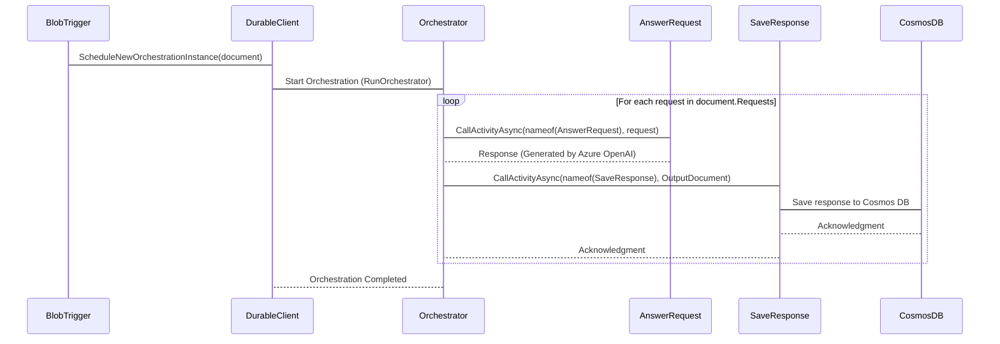

# Create a Simple AI Data Pipeline with Azure Durable Functions

This sample demonstrates how to build a data pipeline using [Azure Durable Functions](https://learn.microsoft.com/azure/azure-functions/durable/durable-functions-overview). The pipeline performs the following tasks:

1. Reads questions from a JSON file dropped as a blob in an [Azure Storage Account](https://learn.microsoft.com/azure/storage/common/storage-account-overview).
2. Sends the questions to an [Azure OpenAI Service](https://learn.microsoft.com/azure/ai-services/openai/overview) chat model for processing.
3. Stores the processed results as individual documents in an [Azure Cosmos DB](https://learn.microsoft.com/azure/cosmos-db/introduction) database.

This repository includes:

- A collection of [Bicep](https://learn.microsoft.com/azure/azure-resource-manager/bicep/overview?tabs=bicep) templates to deploy the required Azure infrastructure.
- The Azure Functions application code written in C#.

You can use the following button to deploy the Azure resources from the Azure portal:

## UML Sequence Diagram

The Azure Function App implements a durable workflow to process questions from a JSON file and store the results in Azure Cosmos DB. The following UML sequence diagram represents the message flow.

Below is a detailed explanation of each step in the flow:

1. **BlobTrigger Function**:
   - The workflow begins when a JSON file is uploaded to a designated Azure Blob Storage container.
   - The `BlobTrigger` function is triggered by this event and reads the contents of the uploaded file.
   - The function extracts the questions from the JSON file and passes them as input to the Durable Functions client.
2. **DurableClient**:
   - The `DurableClient` schedules a new orchestration instance by invoking the `RunOrchestrator` function.
   - This step ensures that the workflow is managed as a durable and stateful process.
3. **Orchestrator Function**:
   - The `Orchestrator` function coordinates the workflow by executing multiple activities in sequence.
   - It iterates through each question in the input document and processes them one by one.
4. **AnswerRequest Activity**:
   - For each question, the `Orchestrator` calls the `AnswerRequest` activity function.
   - This activity sends the question to the Azure OpenAI Service chat model for processing.
   - The OpenAI Service generates a response (e.g., an answer to the question) and returns it to the `Orchestrator`.
5. **SaveResponse Activity**:
   - After receiving the response from the `AnswerRequest` activity, the `Orchestrator` calls the `SaveResponse` activity function.
   - This activity formats the response into a document and saves it to Azure Cosmos DB.
   - Azure Cosmos DB acknowledges the successful storage of the document.
6. **Acknowledgments**:
   - The `SaveResponse` activity sends an acknowledgment back to the `Orchestrator` upon successful completion.
   - Once all questions are processed, the `Orchestrator` sends a final acknowledgment to the `DurableClient`, indicating that the orchestration is complete.
7. **End of Workflow**:
   - The durable workflow ensures that all steps are executed reliably, even in the event of failures or restarts.
   - The processed results are now stored in Azure Cosmos DB, ready for further use or analysis.

This flow leverages the power of Azure Durable Functions to create a scalable, reliable, and stateful data pipeline for processing and storing AI-generated responses.
